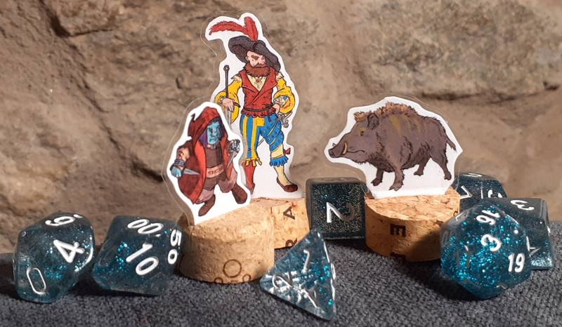

# PaperMiniatures

Support tools to create paper miniatures for TTRPG games like Pathfinder, DnD, etc

The main goals for these miniatures are:
 - to take few space to store
 - to be easy to assemble
 - to use easy-to-get and low-cost tools and materials

This repo offers:
 * a guide on how to create paper miniatures
 * images for some possible miniatures
 * a program to ease the creation of a sheet full of images that can be used to create paper miniatures
